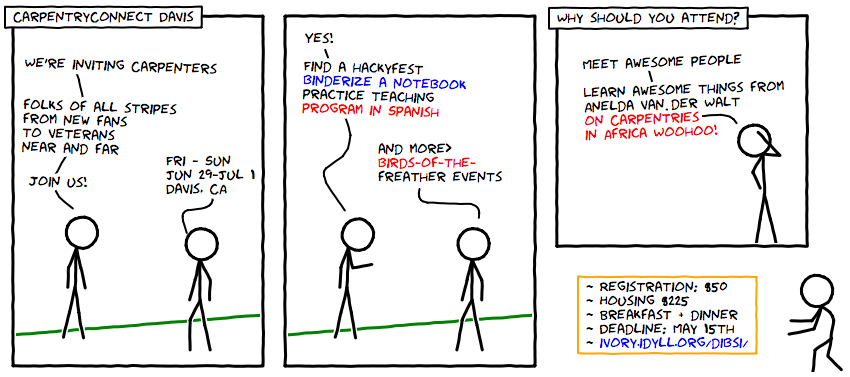

# CarpentryConnect Davis 2018

_Note: If you are looking for the international CarpentryCon event taking place in Dublin on 30 May - 1 June, 2018, please visit [carpentrycon.org](http://www.carpentrycon.org/)._

## You're invited!

We’re inviting Carpentries folks of all stripes — from new fans to veteran community-members, from all disciplines, near and far — to join us for CarpentryConnect Davis! We’ve got housing and space for [DIBSI 2018](http://ivory.idyll.org/dibsi/), our annual bioinformatics summer institute, so we’ve set aside **Friday evening through Sunday morning, June 29-July 1**, for a Carpentries gathering in sunny Davis, California. 

## What to expect
- Lots of social time with a small, friendly Carpentries community!
- Keynote address from [Anelda van der Walt](https://twitter.com/aneldavdw) on  Carpentries communities in Africa
- Other keynotes (TBD!) 
- Discussions about our new **Spanish curriculum**
- An introduction to **Binder** as an instructional tool and a hackyfest to *binderize* repositories 
- On-boarding and **mentorship** opportunities to help new and experienced instructors connect and become familiar with Carpentries curriculum
- **Check-out opportunities** for new instructors! Attendance will be counted as your Discussion session requirement, and we will also offer Demo opportunities for anyone who needs it!
- **Un-conference** style activities proposed by attendees

It’s also worth noting that we still have room at our Carpentries Instructor Training (with Anelda and Sher!) on June 25-26, and will be running a variety of Carpentries workshops on June 27-28. See [DIBSI 2018](http://ivory.idyll.org/dibsi/) for more details!

## Contribute your ideas!

Want to organize a meet-up or activity? We’re happy to facilitate! File an issue in our planning repo: [https://github.com/dib-lab/CarpentryConWest18](https://github.com/dib-lab/CarpentryConWest18)! Or, contact us at [dibsi.training@gmail.com](mailto:dibsi.training@gmail.com). We can help to arrange space and connect you with collaborators to start the planning process.

## How to sign up!

Registration is $50. Housing is available from 6/29-7/2 for $225, which includes breakfast and dinner (but not lunch).

Please register by May 15th to guarantee your place at DIBSI West Coast Carpentry Con. If you’re coming from afar, you’ll need to register *soon* to obtain on-campus housing, which includes breakfast and dinner, as these spaces are limited.

**Local registration (no housing needed)** is here: 
[Local registration link, no housing](https://registration.genomecenter.ucdavis.edu/events/WCCC_DIBSI_2018/)

**Out-of-town registration (includes housing)**\* is here;
[Out-of-town registration link, housing](https://registration.genomecenter.ucdavis.edu/events/WCCC_with_Housing_DIBSI_2018/)

\* If you've already registered for another DIBSI housing block -- Week 1 or the ANGUS 2-week workshop -- please contact [dibsi.training@gmail.com](mailto:dibsi.training@gmail.com) to request a registration link that accounts for overlap between the housing reservation blocks.

## Additional needs

If you have any additional needs of any kind, please do not hesitate to ask! We will be adding information about local activities for children, nursing rooms, and ways we support people of all abilities. We welcome inquiries! 

## Code of Conduct

All contributions are expected to follow the Carpentries' [code of conduct](https://software-carpentry.org/conduct/).
