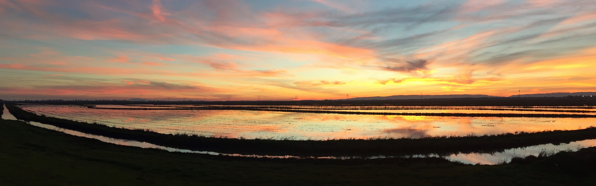

# 2017 Data Intensive Biology Summer Institute at UC Davis

From June 18 to July 21, 2017, we'll be running several different
computational training events at the University of California, Davis
-- a two-week workshop for biologists to learn basic bioinformatics
and high performance computing, a week-long instructor training in how to reuse our
materials, and several other focused workshops.

All of this will be taking place at the UC Davis School of Veterinary
Medicine, on the main campus of UC Davis (in Davis,
CA). [Read more...](VENUE.html)

Everyone is welcome, from everywhere! Grad students, postdocs,
faculty, staff, industry, non-profits, teachers, journalists, and
grant managers may all find these workshops useful. **We welcome
applications from international students and regard the current
policies of the United States with frustration and dismay.**
[Read more...](ATTENDEES.html)

Each workshop costs between $350 and $500, and room & board will be
about $500/week for non-local attendees.

### [Two-week sequence analysis workshop for biologists!](ANGUS.html)

[The ANGUS workshop](ANGUS.html) will run from June 26 to July 8th.

* Zero-entry - **no experience** required or expected!
* Hands-on training in using the UNIX command line to analyze your sequencing data.
* Friendly, helpful instructors and TAs!
* Summer sequencing camp - meet and talk science with great people!
* Now in its eighth year!

<!-- [Apply here!](https://docs.google.com/forms/d/e/1FAIpQLSchSuErTHw9aleA_peGZsXwFHiXmr2GM4OMqgFxqY03DGiL-g/viewform) - applications will close **March 17th**. -->

**If you applied for ANGUS, we sent you registration information on
Monday, April 17th.  Please contact
[dibsi.training@gmail.com](mailto:dibsi.training@gmail.com) if you
didn't receive them.**

### [Instructor training!](instructor-training.html)

[The instructor training workshop](instructor-training.html) will run
from June 18 to June 25.

* Hands-on training in good pedagogical practice!
* Become a certified Software/Data Carpentry instructor!
* Learn to repurpose and remix online training materials for your own needs!

<!-- [Apply here!](https://docs.google.com/forms/d/e/1FAIpQLSfC1MphcIhfNQzJKrbuuMBePTF0FFB_t3XJzYeWpMn1hWdxTQ/viewform) - applications will close **March 17th**. -->

**If you applied for instructor training, we sent you registration
information on Monday, April 17th. Please contact
[dibsi.training@gmail.com](mailto:dibsi.training@gmail.com) if you
didn't receive them.**

### Topic specific workshops

We are running nine topic-specific workshops this summer!  Visit
[the workshops page](workshops.html) for details or click on the
image below.

Workshops are $350/wk to attend, plus room/board if you are staying on
campus.

Week 1: July 10-15

* [Genome Wide Association Study Workshop](workshops.html#genome-wide-association-study-workshop) - Tamer Mansour and Erica Scott
* [Undergraduate Curriculum Hackathon](workshops.html#undergraduate-curriculum-hackathon)
* [Introduction to Python](workshops.html#introduction-to-python) - Emily Dolson
* [Reproducible research with R/Data Hackathon](workshops.html#reproducible-research-with-r-data-hackathon) - Chris Hamm
* [Cloud Training Materials Development](workshops.html#cloud-training-materials-development) - Daniel Standage and Luiz Irber

Week 2: July 17-21

* [Introduction to Transposon Insertion Sequencing Analysis (TNSeq/INSeq)](workshops.html#introduction-to-transposon-insertion-sequencing-analysis) - Mark Mandel
* [Environmental Metagenomics](workshops.html#environmental-metagenomics-dibsi-em) - Harriet Alexander
* [Non-model RNAseq, bring your own data](workshops.html#non-model-rnaseq-bring-your-own-data) - Tessa Pierce, Jane Khudyakov, and Lisa Cohen
* [Introduction to R](workshops.html#introduction-to-r) - Michael Koontz

### Are you an undergraduate interested in a summer research experience? 

We are launching a summer research program for students from groups 
historically underrepresented in biology. Summer interns will particpate 
in DIBSRP and an 8-10 week mentored research project in data biology (i.e. metagenomics, 
transcriptomics, etc.). More info [here](DIBSRP.html); if you have questions 
send us an e-mail at [dibsrp@gmail.com](mailto:dibsrp@gmail.com). 

### Are you interested in joining us as an instructor or a TA?

We are looking for people to join us - see our
[getting involved](getting-involved.html) page! (We will cover travel,
room and board.)

## Other information

Keep up to date by [joining our mailing list](http://lists.idyll.org/listinfo/dibsi-2017-interest).

[General information for attendees](ATTENDEES.html)

[Information on the venue](VENUE.html)

[Funding information](FUNDERS.html)

[Who is DIBSI?](WHO.html)

[The two-week summer workshop materials from 2016](angus.readthedocs.io/en/2016/)

----

If you have questions, please contact us at via e-mail at [dibsi.training@gmail.com](mailto:dibsi.training@gmail.com).
